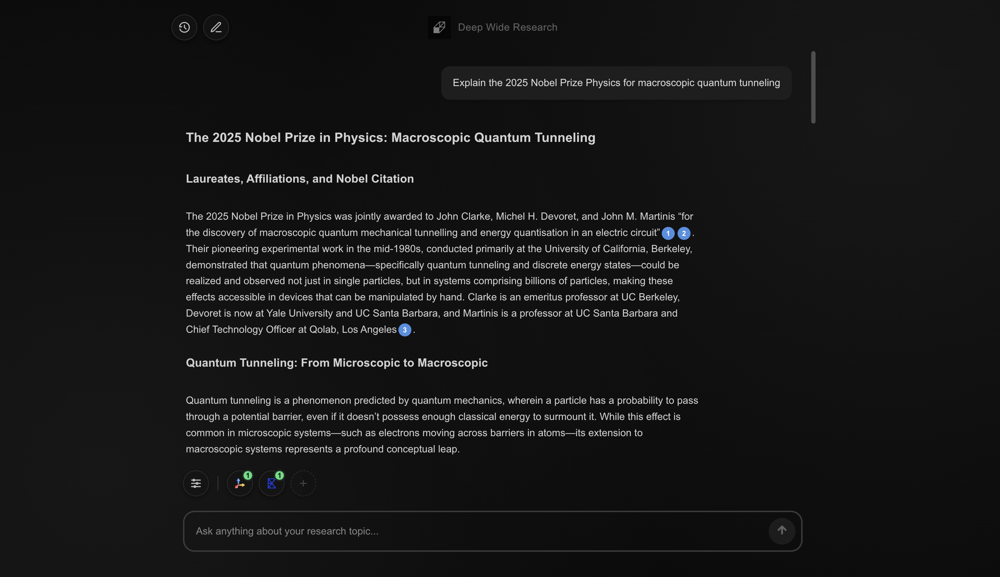
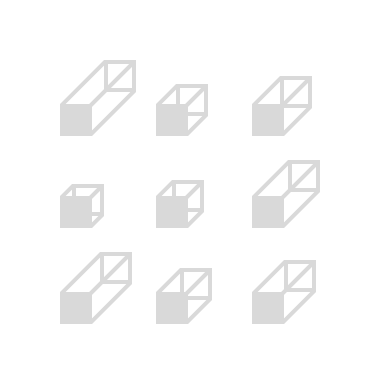
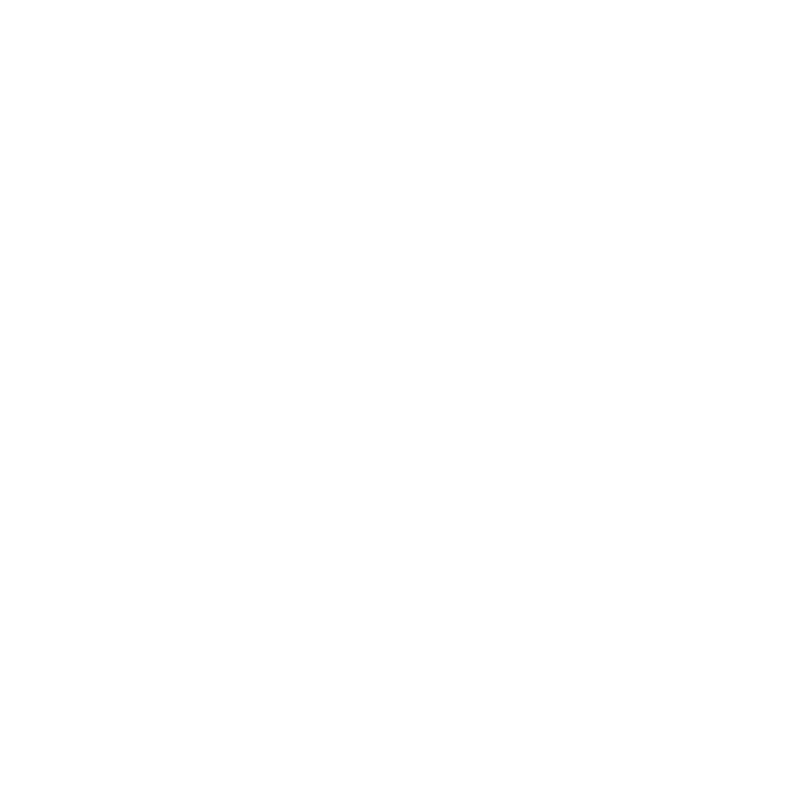
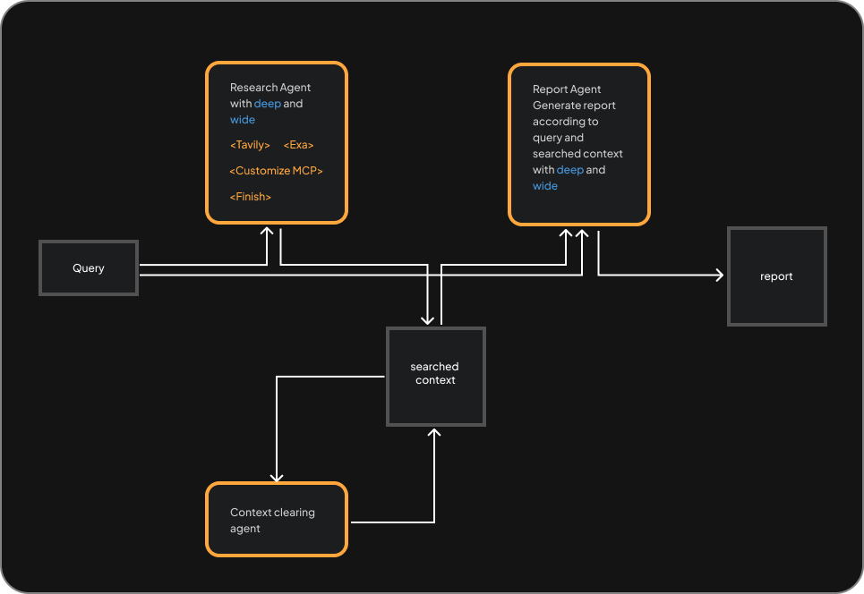

<p align="center">
  
</p>

<h1 align="center">Open Deep Wide Research</h1>

<p align="center">
  <a href="https://www.puppyagent.com" target="_blank">
    
  </a>
  <a href="https://x.com/PuppyAgentTech" target="_blank">
    
  </a>
  <a href="https://discord.gg/puppychat" target="_blank">
    
  </a>
  <a href="mailto:support@puppyagent.com">
    
  </a>
</p>

<p align="center">
  Build any agentic RAG with depth & width
</p>

<p align="center">
  
</p>

## Why Do You Need Open Deep Wide Research?

In 2025, we observed three critical trends reshaping the Retrieval-Augmented Generation (RAG) tech stacks:

1.  Traditional, Rigid, pipeline-driven RAG is giving way to more dynamic agentic RAG systems.

2.  The emergence of MCP is dramatically lowering the complexity of developing enterprise-grade Agentic RAG.

3.  Developers desperately need to customize and balance response time, the breadth of information retrieval, and cost. However, most agent solution ignore this critical requirement.

Based on these trends, the market needs a single, open-source RAG agent that is MCP-compatible and offers granular control over performance, scope, and cost.

We built **Open Deep Wide Research** to be that solution, providing one agent for all RAG scenarios. Its core is the "Deep/Wide" coordinate system, which gives you the control you need:

- **Deep:** Controls response time and reasoning depth.
- **Wide:** Controls information breadth from various sources.
- **Deep × Wide:** Predicts the cost of a single agentic RAG response.

**Example Scenarios:**

<table>
<thead>
<tr>
<th align="left"><sub>Scenario</sub></th>
<th align="left"><sub>Settings</sub></th>
<th align="left"><sub>Use Case</sub></th>
<th align="center"><sub>Time</sub></th>
<th align="center"><sub>Cost</sub></th>
</tr>
</thead>
<tbody>
<tr>
<td align="left"><sub><b>Quick Chat</b></sub></td>
<td align="left"><sub>Deep: <code>███░░░░░░░░░</code> 25%<br/>Wide: <code>███░░░░░░░░░</code> 25%</sub></td>
<td align="left"><sub>Fast Q&A</sub></td>
<td align="center"><sub>~5-10s</sub></td>
<td align="center"><sub>$0.05</sub></td>
</tr>
<tr>
<td align="left"><sub><b>Deep Analysis</b></sub></td>
<td align="left"><sub>Deep: <code>████████████</code> 100%<br/>Wide: <code>███░░░░░░░░░</code> 25%</sub></td>
<td align="left"><sub>Technical deep dive</sub></td>
<td align="center"><sub>~1-2min</sub></td>
<td align="center"><sub>$0.30-0.50</sub></td>
</tr>
<tr>
<td align="left"><sub><b>Wide Survey</b></sub></td>
<td align="left"><sub>Deep: <code>███░░░░░░░░░</code> 25%<br/>Wide: <code>████████████</code> 100%</sub></td>
<td align="left"><sub>Broad market research</sub></td>
<td align="center"><sub>~30-60s</sub></td>
<td align="center"><sub>$0.20-0.40</sub></td>
</tr>
<tr>
<td align="left"><sub><b>Balanced Research</b></sub></td>
<td align="left"><sub>Deep: <code>██████░░░░░░</code> 50%<br/>Wide: <code>██████░░░░░░</code> 50%</sub></td>
<td align="left"><sub>General research</sub></td>
<td align="center"><sub>~1-2min</sub></td>
<td align="center"><sub>$0.30-0.60</sub></td>
</tr>
<tr>
<td align="left"><sub><b>Ultra Deep Dive</b></sub></td>
<td align="left"><sub>Deep: <code>████████████</code> 100%<br/>Wide: <code>████████████</code> 100%</sub></td>
<td align="left"><sub>Maximum depth & breadth</sub></td>
<td align="center"><sub>~5min</sub></td>
<td align="center"><sub>$0.50-2.00</sub></td>
</tr>
</tbody>
</table>

> If this mission resonates with you, please give us a star ⭐ and fork it! 🤞


## Features

- **Deep × Wide Control** – Tune the depth of reasoning and breadth of information sources to perfectly match any RAG scenario, from quick chats to in-depth analysis.
- **Predictable Cost Management** – No more surprise bills. Cost is a transparent function of your Deep × Wide settings, giving you full control over your budget.
- **MCP Protocol Native Support** – Built on the Model Context Protocol for seamless integration with any compliant data source or tool, creating a truly extensible and future-proof agent.
- **Self-Hosted for Maximum Privacy** – Deploy on your own infrastructure to maintain absolute control over your data and meet the strictest security requirements.
- **Hot‑Swappable Models** – Plug in OpenAI, Claude, or your private LLM instantly.
- **Customizable Search Engines** – Integrate any search provider. Tavily and Exa supported out-of-the-box. As long as it supports MCP.


## How We Compare

<table>
<thead>
<tr>
<th align="left"><sub>Feature</sub></th>
<th align="center"><sub><br/>Open<br/>Deep Wide<br/>Research</sub></th>
<th align="center"><sub><br/>OpenAI<br/>Deep Research</sub></th>
<th align="center"><sub><br/>Gemini<br/>Deep Research</sub></th>
<th align="center"><sub><br/>Manus<br/>Wide Research</sub></th>
<th align="center"><sub><br/>GenSpark<br/>Deep Research</sub></th>
<th align="center"><sub><br/>Jina<br/>DeepSearch</sub></th>
<th align="center"><sub><br/>LangChain<br/>Open Deep Research</sub></th>
</tr>
</thead>
<tbody>
<tr>
<td align="left"><sub><b>Depth × width controls</b></sub></td>
<td align="center"><sub>D x W</sub></td>
<td align="center"><sub>×</sub></td>
<td align="center"><sub>×</sub></td>
<td align="center"><sub>W</sub></td>
<td align="center"><sub>×</sub></td>
<td align="center"><sub>D</sub></td>
<td align="center"><sub>×</sub></td>
</tr>
<tr>
<td align="left"><sub><b>Open source</b></sub></td>
<td align="center"><sub>✅</sub></td>
<td align="center"><sub>×</sub></td>
<td align="center"><sub>×</sub></td>
<td align="center"><sub>×</sub></td>
<td align="center"><sub>×</sub></td>
<td align="center"><sub>✅</sub></td>
<td align="center"><sub>✅</sub></td>
</tr>
<tr>
<td align="left"><sub><b>MCP support</b></sub></td>
<td align="center"><sub>✅</sub></td>
<td align="center"><sub>✅</sub></td>
<td align="center"><sub>×</sub></td>
<td align="center"><sub>×</sub></td>
<td align="center"><sub>×</sub></td>
<td align="center"><sub>✅</sub></td>
<td align="center"><sub>×</sub></td>
</tr>
<tr>
<td align="left"><sub><b>SDK / API</b></sub></td>
<td align="center"><sub>✅</sub></td>
<td align="center"><sub>✅</sub></td>
<td align="center"><sub>✅</sub></td>
<td align="center"><sub>×</sub></td>
<td align="center"><sub>×</sub></td>
<td align="center"><sub>✅</sub></td>
<td align="center"><sub>✅</sub></td>
</tr>
<tr>
<td align="left"><sub><b>Local knowledge</b></sub></td>
<td align="center"><sub>✅</sub></td>
<td align="center"><sub>×</sub></td>
<td align="center"><sub>×</sub></td>
<td align="center"><sub>×</sub></td>
<td align="center"><sub>×</sub></td>
<td align="center"><sub>✅</sub></td>
<td align="center"><sub>✅</sub></td>
</tr>
<tr>
<td align="left"><sub><b>Model flexibility</b></sub></td>
<td align="center"><sub>✅</sub></td>
<td align="center"><sub>×</sub></td>
<td align="center"><sub>×</sub></td>
<td align="center"><sub>×</sub></td>
<td align="center"><sub>×</sub></td>
<td align="center"><sub>×</sub></td>
<td align="center"><sub>✅</sub></td>
</tr>
<tr>
<td align="left"><sub><b>Search engine flexibility</b></sub></td>
<td align="center"><sub>✅</sub></td>
<td align="center"><sub>×</sub></td>
<td align="center"><sub>×</sub></td>
<td align="center"><sub>×</sub></td>
<td align="center"><sub>×</sub></td>
<td align="center"><sub>×</sub></td>
<td align="center"><sub>×</sub></td>
</tr>
<tr>
<td align="left"><sub><b>Performance</b></sub></td>
<td align="center"><sub>5</sub></td>
<td align="center"><sub>5</sub></td>
<td align="center"><sub>4</sub></td>
<td align="center"><sub>3</sub></td>
<td align="center"><sub>4</sub></td>
<td align="center"><sub>4</sub></td>
<td align="center"><sub>3</sub></td>
</tr>
</tbody>
</table>

<sub><i>Names are trademarks of their owners; descriptions are generalized and may change.</i></sub>


## Get Started

### Prerequisites
- Python 3.9+ and Node.js 18+
- API keys: Open Router (required), and  Exa / Tavily (at least one)
- Recommended model: open-o4mini

### Deployment Options
- API-only (Backend): If you only need the Deep Research backend as an API to embed in your codebase, deploy the backend only.
- Full stack (Frontend + Backend): If you want the full experience with the web UI, deploy both the backend and the frontend.

### Backend

1. Copy the env template:

```bash
cp deep_wide_research/env.example deep_wide_research/.env
```

2. Edit the copied .env and set your keys:

```bash
# deep_wide_research/.env
OPENROUTER_API_KEY=your_key
# At least one of the following
EXA_API_KEY=your_exa_key
# or
TAVILY_API_KEY=your_tavily_key
```

> You can obtain the Tavily and Exa API keys from their official sites: [Tavily](https://www.tavily.com/) and [Exa](https://exa.ai/).

3. Set up the environment:

```bash
cd deep_wide_research
python -m venv deep-wide-research
source deep-wide-research/bin/activate
pip install -r requirements.txt
```

4. Start the backend server:

```bash
python main.py
```

### Frontend

1. Copy the env template:

```bash
cp chat_interface/env.example chat_interface/.env.local
```

2. Install dependencies and start the dev server:

```bash
cd chat_interface
npm install
npm run dev
```

3. Open the app:

Open **http://localhost:3000** – Start researching in seconds.

### Docker (Production)

```bash
docker-compose up -d
```

---


### Deep Wide Research Archietecture

<p align="center">
  
</p>

---

## License

This project is licensed under the Apache License, Version 2.0. See the [LICENSE](LICENSE) file for details.

Copyright (c) 2025 PuppyAgent and contributors.
