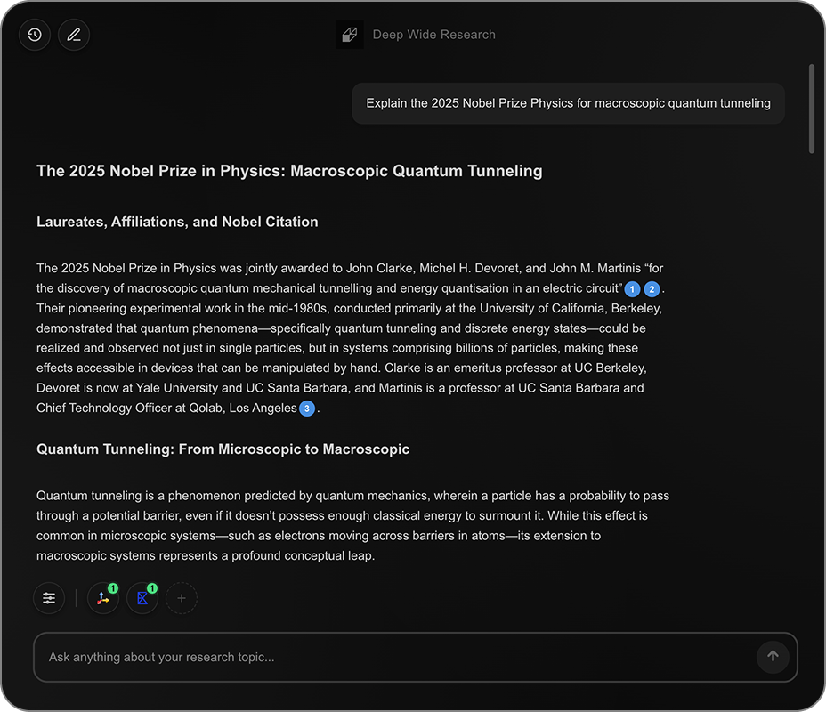

<p align="center">
  
</p>

<h1 align="center">Open Deep Wide Research</h1>

<p align="center">
  <a href="https://go.deepwideresearch.com/4o5mSMy" target="_blank">
    
  </a>
  <a href="https://x.com/deepwiderag" target="_blank">
    
  </a>
  <a href="https://discord.gg/puppychat" target="_blank">
    
  </a>
  <a href="mailto:guantum@puppyagent.com">
    
  </a>
</p>

<p align="center">
  Agentic RAG for any scenario<br>Customize sources, depth, and width
</p>

<p align="center">
  
</p>

## Why Do You Need Open Deep Wide Research?

In 2025, we observed three critical trends reshaping the Retrieval-Augmented Generation (RAG) tech stacks:

1.  Traditional, Rigid, pipeline-driven RAG is giving way to more dynamic agentic RAG systems.

2.  The emergence of MCP is dramatically lowering the complexity of developing enterprise level Agentic RAG.

However, a core pain point remains: 

Developers still struggle to balance response quality, speed, and cost, as most agentic solutions offer a rigid, one-size-fits-all approach.

Based on these trends and the core pain point, the market needs a single, open-source RAG agent that is MCP-compatible and offers granular control over performance, scope, and cost.

We built **Open Deep Wide Research** to be that solution, providing one agent for all RAG scenarios. It gives you granular control over the core dimensions of agentic research:

*   **Sources**: Connect custom data sources, from internal knowledge bases to specialized APIs.
*   **Deep**: Controls response time and reasoning depth.
*   **Wide**: Controls information breadth across your selected sources.

The "Deep × Wide" coordinate system also transparently predicts the cost of each response, giving you full budget control.

**Example Scenarios:**

<table>
<thead>
<tr>
<th align="left"><sub>User Story</sub></th>
<th align="left"><sub>Settings</sub></th>
<th align="left"><sub>Example Query</sub></th>
<th align="center"><sub>Time</sub></th>
<th align="center"><sub>Cost</sub></th>
</tr>
</thead>
<tbody>
<tr>
<td align="left"><sub><b>Customer Service Bot</b></sub></td>
<td align="left"><sub>Deep: <code>███░░░░░░░░░</code> 25%<br/>Wide: <code>███░░░░░░░░░</code> 25%</sub></td>
<td align="left"><sub>"What glasses do you provide?"</sub></td>
<td align="center"><sub>~10s</sub></td>
<td align="center"><sub>~$0.01</sub></td>
</tr>
<tr>
<td align="left"><sub><b>Market Research</b></sub></td>
<td align="left"><sub>Deep: <code>███░░░░░░░░░</code> 25%<br/>Wide: <code>████████████</code> 100%</sub></td>
<td align="left"><sub>"100 Notion and Airtable alternatives"</sub></td>
<td align="center"><sub>~2-3min</sub></td>
<td align="center"><sub>~$0.10</sub></td>
</tr>
<tr>
<td align="left"><sub><b>Enterprise Analytics</b></sub></td>
<td align="left"><sub>Deep: <code>████████████</code> 100%<br/>Wide: <code>████████████</code> 100%</sub></td>
<td align="left"><sub>"What was the ROI of our latest marketing campaign?"</sub></td>
<td align="center"><sub>~5min</sub></td>
<td align="center"><sub>~$1.00</sub></td>
</tr>
</tbody>
</table>

> If this mission resonates with you, please give us a star ⭐ and fork it! 🤞

## Features

- **Deep × Wide Control** – Tune the depth of reasoning and breadth of information sources to perfectly match any RAG scenario, from quick chats to in-depth analysis.
- **Predictable Cost Management** – No more surprise bills. Cost is a transparent function of your Deep × Wide settings, giving you full control over your budget.
- **MCP Protocol Native Support** – Built on the Model Context Protocol for seamless integration with any compliant data source or tool, creating a truly extensible and future-proof agent.
- **Self-Hosted for Maximum Privacy** – Deploy on your own infrastructure to maintain absolute control over your data and meet the strictest security requirements.
- **Hot‑Swappable Models** – Plug in OpenAI, Claude, or your private LLM instantly.
- **Customizable Search Engines** – Integrate any search provider. Tavily and Exa supported out-of-the-box. As long as it supports MCP.


## Get Started

### Prerequisites

#### Python 3.9+ Installation

**Windows:**
- Download from [python.org](https://www.python.org/downloads/) or use Windows Store
- Or use Chocolatey: `choco install python`
- Or use winget: `winget install Python.Python.3.11`

**macOS:**
- Using Homebrew: `brew install python@3.11`
- Or download from [python.org](https://www.python.org/downloads/)

**Linux (Ubuntu/Debian):**
```bash
sudo apt update
sudo apt install python3 python3-pip python3-venv
```

**Linux (Fedora/RHEL):**
```bash
sudo dnf install python3 python3-pip
```

#### Node.js 18+ Installation

**Windows:**
- Download from [nodejs.org](https://nodejs.org/) or use Windows Store
- Or use Chocolatey: `choco install nodejs`
- Or use winget: `winget install OpenJS.NodeJS`

**macOS:**
- Using Homebrew: `brew install node`
- Or download from [nodejs.org](https://nodejs.org/)

**Linux (Ubuntu/Debian):**
```bash
curl -fsSL https://deb.nodesource.com/setup_20.x | sudo -E bash -
sudo apt install -y nodejs
```

**Linux (Fedora/RHEL):**
```bash
curl -fsSL https://rpm.nodesource.com/setup_20.x | sudo bash -
sudo dnf install -y nodejs
```

#### API Keys
- **OpenRouter API Key** (required): Get from [OpenRouter](https://openrouter.ai/)
- **Exa API Key** (at least one required): Get from [Exa](https://exa.ai/)
- **Tavily API Key** (at least one required): Get from [Tavily](https://www.tavily.com/)
- **Recommended model**: `openai/o4-mini`

### Deployment Options
- **API-only (Backend)**: If you only need the Deep Research backend as an API to embed in your codebase, deploy the backend only.
- **Full stack (Frontend + Backend)**: If you want the full experience with the web UI, deploy both the backend and the frontend.

### Backend

#### Step 1: Copy Environment Template

**Windows (PowerShell):**
```powershell
Copy-Item deep_wide_research\env.example deep_wide_research\.env
```

**Windows (CMD):**
```cmd
copy deep_wide_research\env.example deep_wide_research\.env
```

**macOS/Linux:**
```bash
cp deep_wide_research/env.example deep_wide_research/.env
```

#### Step 2: Configure Environment Variables

Edit `deep_wide_research/.env` and set your API keys:

```bash
# deep_wide_research/.env
OPENROUTER_API_KEY=your_key
# At least one of the following
EXA_API_KEY=your_exa_key
# or
TAVILY_API_KEY=your_tavily_key
```

#### Step 3: Set Up Python Environment

**Option A: Using pip (Recommended)**

**Windows:**
```powershell
cd deep_wide_research
python -m venv deep-wide-research
.\deep-wide-research\Scripts\Activate.ps1
pip install -r requirements.txt
```

**macOS/Linux:**
```bash
cd deep_wide_research
python3 -m venv deep-wide-research
source deep-wide-research/bin/activate
pip install -r requirements.txt
```

**Option B: Using conda**

**All Platforms:**
```bash
cd deep_wide_research
conda create -n deep-wide-research python=3.11
conda activate deep-wide-research
pip install -r requirements.txt
```

#### Step 4: Start Backend Server

**Windows:**
```powershell
python main.py
```

**macOS/Linux:**
```bash
python main.py
# or
python3 main.py
```

The backend will start on `http://localhost:8000` by default.

### Frontend

#### Step 1: Copy Environment Template

**Windows (PowerShell):**
```powershell
Copy-Item chat_interface\env.example chat_interface\.env.local
```

**Windows (CMD):**
```cmd
copy chat_interface\env.example chat_interface\.env.local
```

**macOS/Linux:**
```bash
cp chat_interface/env.example chat_interface/.env.local
```

#### Step 2: Install Dependencies

**Option A: Using npm (Default)**

**All Platforms:**
```bash
cd chat_interface
npm install
```

**Option B: Using yarn**

**Install yarn first (if not installed):**
- Windows: `choco install yarn` or `winget install Yarn.Yarn`
- macOS: `brew install yarn`
- Linux: `npm install -g yarn` or follow [yarn installation guide](https://yarnpkg.com/getting-started/install)

**Then install dependencies:**
```bash
cd chat_interface
yarn install
```

**Option C: Using pnpm**

**Install pnpm first (if not installed):**
- Windows: `choco install pnpm` or `winget install pnpm`
- macOS: `brew install pnpm`
- Linux: `npm install -g pnpm` or follow [pnpm installation guide](https://pnpm.io/installation)

**Then install dependencies:**
```bash
cd chat_interface
pnpm install
```

#### Step 3: Start Development Server

**Using npm:**
```bash
npm run dev
```

**Using yarn:**
```bash
yarn dev
```

**Using pnpm:**
```bash
pnpm dev
```

#### Step 4: Open the Application

Open **http://localhost:3000** in your browser – Start researching in seconds.

### Docker (Production)

```bash
docker-compose up -d
```

---

## How We Compare

<table>
<thead>
<tr>
<th align="left"><sub>Feature</sub></th>
<th align="center"><sub><br/>Open<br/>Deep Wide<br/>Research</sub></th>
<th align="center"><sub><br/>OpenAI<br/>Deep Research</sub></th>
<th align="center"><sub><br/>Gemini<br/>Deep Research</sub></th>
<th align="center"><sub><br/>Manus<br/>Wide Research</sub></th>
<th align="center"><sub><br/>GenSpark<br/>Deep Research</sub></th>
<th align="center"><sub><br/>Jina<br/>DeepSearch</sub></th>
<th align="center"><sub><br/>LangChain<br/>Open Deep Research</sub></th>
</tr>
</thead>
<tbody>
<tr>
<td align="left"><sub><b>Depth × width controls</b></sub></td>
<td align="center"><sub>D x W</sub></td>
<td align="center"><sub>×</sub></td>
<td align="center"><sub>×</sub></td>
<td align="center"><sub>W</sub></td>
<td align="center"><sub>×</sub></td>
<td align="center"><sub>D</sub></td>
<td align="center"><sub>×</sub></td>
</tr>
<tr>
<td align="left"><sub><b>Open source</b></sub></td>
<td align="center"><sub>✅</sub></td>
<td align="center"><sub>×</sub></td>
<td align="center"><sub>×</sub></td>
<td align="center"><sub>×</sub></td>
<td align="center"><sub>×</sub></td>
<td align="center"><sub>✅</sub></td>
<td align="center"><sub>✅</sub></td>
</tr>
<tr>
<td align="left"><sub><b>MCP support</b></sub></td>
<td align="center"><sub>✅</sub></td>
<td align="center"><sub>✅</sub></td>
<td align="center"><sub>×</sub></td>
<td align="center"><sub>×</sub></td>
<td align="center"><sub>×</sub></td>
<td align="center"><sub>✅</sub></td>
<td align="center"><sub>×</sub></td>
</tr>
<tr>
<td align="left"><sub><b>SDK / API</b></sub></td>
<td align="center"><sub>✅</sub></td>
<td align="center"><sub>✅</sub></td>
<td align="center"><sub>✅</sub></td>
<td align="center"><sub>×</sub></td>
<td align="center"><sub>×</sub></td>
<td align="center"><sub>✅</sub></td>
<td align="center"><sub>✅</sub></td>
</tr>
<tr>
<td align="left"><sub><b>Local knowledge</b></sub></td>
<td align="center"><sub>✅</sub></td>
<td align="center"><sub>×</sub></td>
<td align="center"><sub>×</sub></td>
<td align="center"><sub>×</sub></td>
<td align="center"><sub>×</sub></td>
<td align="center"><sub>✅</sub></td>
<td align="center"><sub>✅</sub></td>
</tr>
<tr>
<td align="left"><sub><b>Model flexibility</b></sub></td>
<td align="center"><sub>✅</sub></td>
<td align="center"><sub>×</sub></td>
<td align="center"><sub>×</sub></td>
<td align="center"><sub>×</sub></td>
<td align="center"><sub>×</sub></td>
<td align="center"><sub>×</sub></td>
<td align="center"><sub>✅</sub></td>
</tr>
<tr>
<td align="left"><sub><b>Search engine flexibility</b></sub></td>
<td align="center"><sub>✅</sub></td>
<td align="center"><sub>×</sub></td>
<td align="center"><sub>×</sub></td>
<td align="center"><sub>×</sub></td>
<td align="center"><sub>×</sub></td>
<td align="center"><sub>×</sub></td>
<td align="center"><sub>×</sub></td>
</tr>
<tr>
<td align="left"><sub><b>Performance</b></sub></td>
<td align="center"><sub>5</sub></td>
<td align="center"><sub>5</sub></td>
<td align="center"><sub>4</sub></td>
<td align="center"><sub>3</sub></td>
<td align="center"><sub>4</sub></td>
<td align="center"><sub>4</sub></td>
<td align="center"><sub>3</sub></td>
</tr>
</tbody>
</table>

<sub><i>Names are trademarks of their owners; descriptions are generalized and may change.</i></sub>

---

### Deep Wide Research Archietecture

<p align="center">
  
</p>

---

## License

This project is licensed under the Apache License, Version 2.0. See the [LICENSE](LICENSE) file for details.

Copyright (c) 2025 PuppyAgent and contributors.
